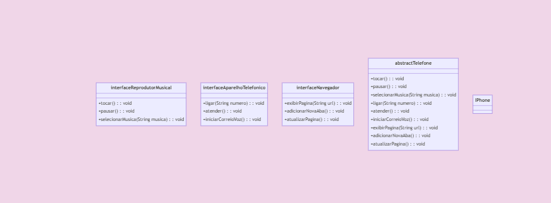
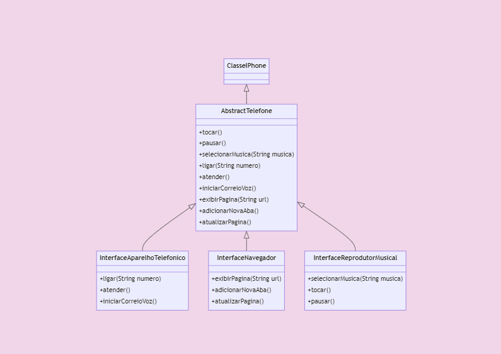

<h1>Trilha Java Básico - Desafio Telefone</h1>

<h2>Conteúdo do desafio: </h2>

> <h3 style="margin: 0;">Modelagem e Diagramação de um Componente iPhone</h3>
> 
 Neste desafio, você será responsável por modelar e diagramar a representação UML do componente iPhone, abrangendo suas funcionalidades como Reprodutor Musical, Aparelho Telefônico e Navegador na Internet. 

<h4>Contexto</h4>

Com base no vídeo de lançamento do iPhone de 2007 (link abaixo), você deve elaborar a diagramação das classes e interfaces utilizando uma ferramenta UML de sua preferência. Em seguida, implemente as classes e interfaces no formato de arquivos `.java`.

[Lançamento iPhone 2007](https://www.youtube.com/watch?v=9ou608QQRq8)

* 
Minutos relevantes: 00:15 até 00:55

#### Funcionalidades a Modelar
1. **Reprodutor Musical**
    - Métodos: `tocar()`, `pausar()`, `selecionarMusica(String musica)`
2. **Aparelho Telefônico**
    - Métodos: `ligar(String numero)`, `atender()`, `iniciarCorreioVoz()`
3. **Navegador na Internet**
    - Métodos: `exibirPagina(String url)`, `adicionarNovaAba()`, `atualizarPagina()`

### Objetivo
1. Criar um diagrama UML que represente as funcionalidades descritas acima.
2. Implementar as classes e interfaces correspondentes em Java (Opcional).

<h2>Aqui estão os modelos de classes: </h2>

<h2>Aqui está o diagrama de implementação das classes: </h2>

<h4>Neste mesmo repositório você encontrará todo o código fonte que implementa a solução desenhada nos fluxos acima.</h4>